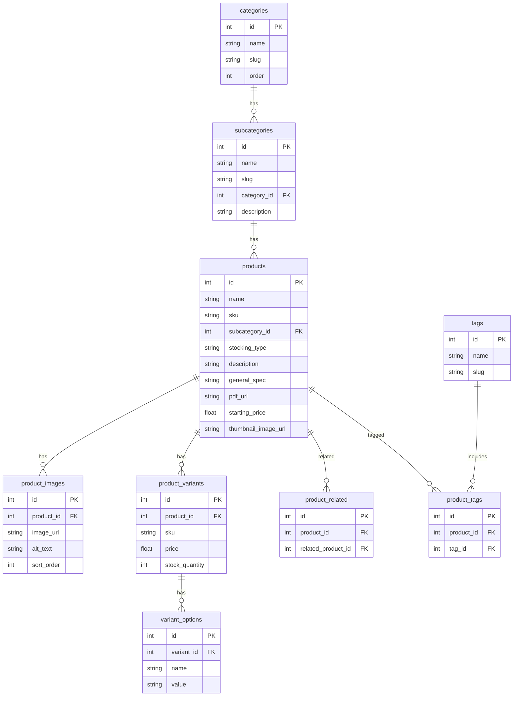
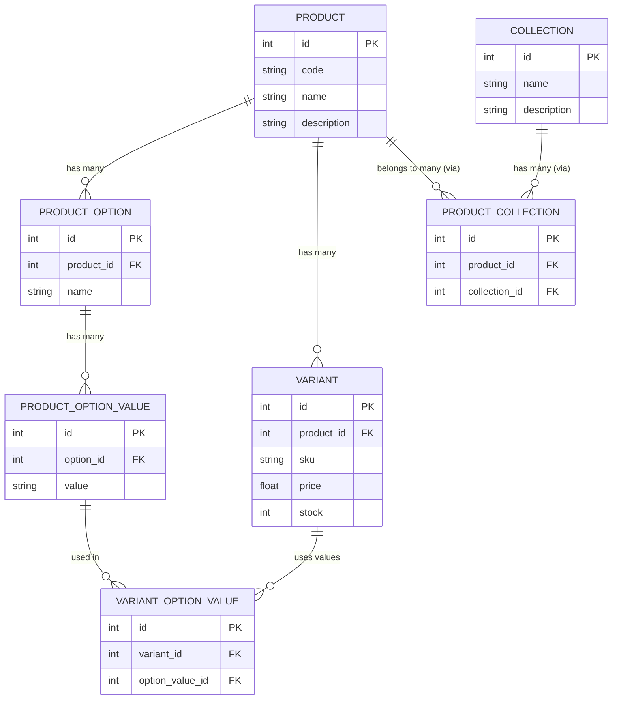

overall
- remove boxes and border.
- fix mobile nav. trnsparent bg, border, 

homepage

products
- mobile filter section. give search bar page width.

product detial
- add product variance

about

capa

contact
- change send message to gMaps

view quotes
- remove submit quotes
- export quotes as jpg
- send quotes to line
- mobile is overflowing.


```prisma
generator client {
  provider = "prisma-client-js"
}

datasource db {
  provider = "postgresql"
  url      = env("DATABASE_URL") // Supabase PostgreSQL URL
}

model Category {
  id       Int            @id @default(autoincrement())
  name     String
  slug     String         @unique
  order    Int
  subcategories Subcategory[]
}

model Subcategory {
  id          Int       @id @default(autoincrement())
  name        String
  slug        String    @unique
  description String?
  category    Category  @relation(fields: [categoryId], references: [id])
  categoryId  Int
  products    Product[]
}

model Product {
  id                Int              @id @default(autoincrement())
  name              String
  sku               String           @unique
  stockingType      String
  description       String
  generalSpec       String
  pdfUrl            String?
  startingPrice     Float
  thumbnailImageUrl String?
  subcategory       Subcategory      @relation(fields: [subcategoryId], references: [id])
  subcategoryId     Int

  images            ProductImage[]
  variants          ProductVariant[]
  relatedProducts   ProductRelated[] @relation("RelatedFrom")
  relatedToProducts ProductRelated[] @relation("RelatedTo")
  tags              ProductTag[]
}

model ProductImage {
  id        Int     @id @default(autoincrement())
  imageUrl  String
  altText   String?
  sortOrder Int
  product   Product @relation(fields: [productId], references: [id])
  productId Int
}

model ProductVariant {
  id             Int              @id @default(autoincrement())
  sku            String           @unique
  price          Float
  stockQuantity  Int
  product        Product          @relation(fields: [productId], references: [id])
  productId      Int
  variantOptions VariantOption[]
}

model VariantOption {
  id         Int             @id @default(autoincrement())
  name       String          // e.g. "Color"
  value      String          // e.g. "Red"
  variant    ProductVariant  @relation(fields: [variantId], references: [id])
  variantId  Int
}

model ProductRelated {
  id               Int     @id @default(autoincrement())
  product          Product @relation("RelatedFrom", fields: [productId], references: [id])
  productId        Int
  relatedProduct   Product @relation("RelatedTo", fields: [relatedProductId], references: [id])
  relatedProductId Int
}

model Tag {
  id    Int           @id @default(autoincrement())
  name  String
  slug  String        @unique
  products ProductTag[]
}

model ProductTag {
  id        Int     @id @default(autoincrement())
  product   Product @relation(fields: [productId], references: [id])
  productId Int
  tag       Tag     @relation(fields: [tagId], references: [id])
  tagId     Int
}
```





---

new mermaid product only, collection.

